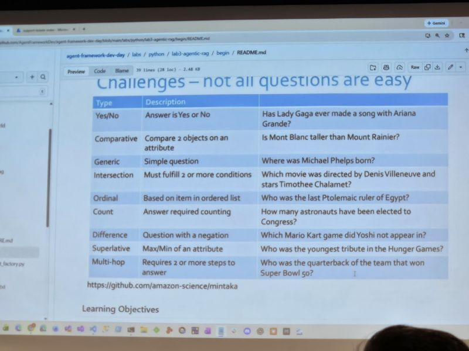
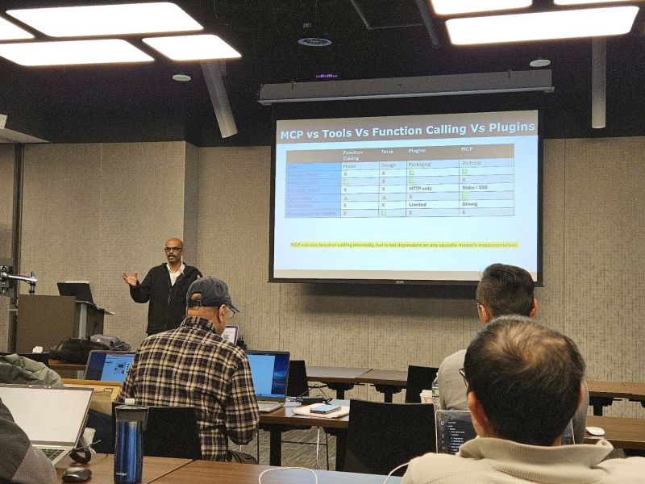
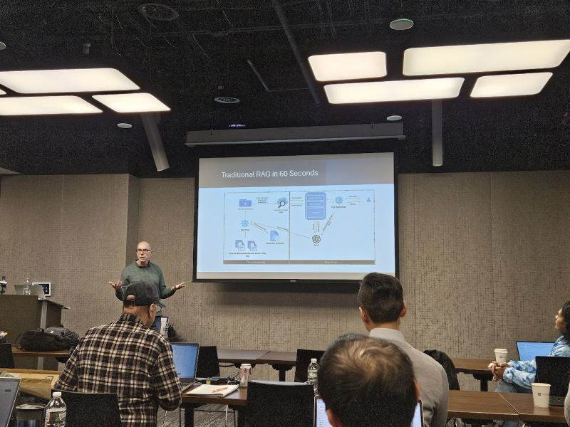

# Memories

## 16-Jan-2026 - Agent Framework Dev Day

We burned more than 3 million inference tokens during the day:

3008.03k

### A few more photos, courtesy of [Dan Gerry](https://www.linkedin.com/feed/update/urn:li:activity:7419077106162098176/)

